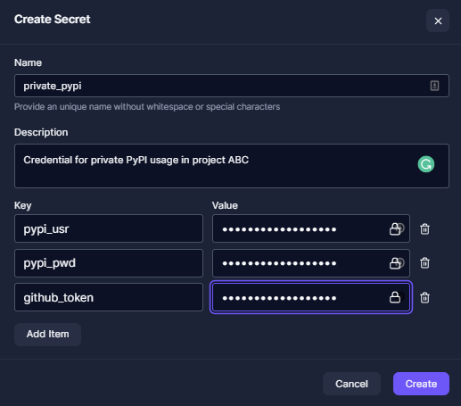

# Using private python packages in robots

Recipe for using private packages securely with credentials in Robocorp Vault.

In the example [requirements-private.txt](https://github.com/robocorp/example-private-pypi/blob/master/requirements-private.txt)
you'll find how to install Python packages from different sources:
- Private PyPI service.
- Private GitHub repository.
- Local source with a directory path accessible by the robot.

## Setup & Run

1. Go to Robocorp Control Room and create a Vault secret with name: `private_pypi` and add the following keys:
   - `pypi_usr` : username for private PyPI source
   - `pypi_pwd` : password for private PyPI source
   - `github_token` : Access token for GitHub source  
     

2. Link your VS Code Robocorp extension to Control Room so that it has access to the Vault secrets.
   * The robot executions with Workforce Agent and Assistant automatically get the secure Vault access.
3. Run the bot with VSCode and select a task demonstrating how the private packages get installed and used.

## Tasks

- `Private PyPI Library Usage`
  - Installs and uses a library from a private PyPI.
  - Requires a Vault secret with name `private_pypi` containing keys: `pypi_usr` and `pypi_pwd`.
- `Private Repo Or Local Source Library Usage`
  - Installs and uses a library from either a private repository or a local source. 
  - Requires a Vault secret with the name `private_pypi` containing key: `github_token`.

## How it works

1. The [robot.yaml](https://github.com/robocorp/example-private-pypi/blob/master/robot.yaml) contains an entry called `preRunScripts` which instructs **rcc** to execute a script like [private-pip-install.py](https://github.com/robocorp/example-private-pypi/blob/master/bin/private-pip-install.py) right before the robot run.
2. The script receives as parameters the Vault secret store name and the path to the [requirements](https://github.com/robocorp/example-private-pypi/blob/master/requirements-private.txt) file to be installed by **pip**, containing private sources for the dependencies.
3. The script injects into the environment variables used by the `pip install`, which is run to install the private requirements.
4. Once the script finishes, the selected task will run and use the previous library installed, thus demonstrating that the Python environment contains the requested dependencies from private sources.
